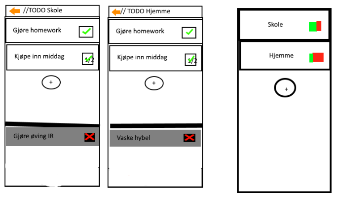
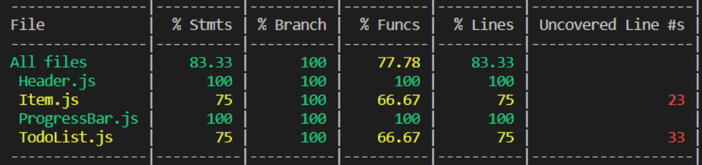

# Dokumentasjon

Intro

## Gruppemedlemmer:

- Filip Hagen
- Simon Nordvold Barak
- Truls Andreas Berglund

Link til repository:

[https://github.com/IT2810/it2810-webutvikling-h18-prosjekt-3-18](https://github.com/IT2810/it2810-webutvikling-h18-prosjekt-3-18)

## Oppnåelse av krav

Kravene til dette prosjektet var i grove trekk:

- Bruk av REACT Native
- Plattform-uavhengighet
- Testing ved bruk av JEST og enhetstesting
- Bruk av git/version control
- Bruk av AsyncStorage

### REACT Native

I løpet av oppstartsfasen av prosjektet lagde vi en plan for hvordan komponent og UI-designet skulle se ut og fungere. Først ble vi enig om funksjonene vi skulle ha på websiden, deretter lagde vi en mockup av utseendet til siden, og tilslutt baserte på dette designet planla vi hvilke komponenter vi skulle ha og funksjonene deres.

Ved bruk av react native og egenskapene til den har vi også oppnådd kravet om å ha plattform uavhengighet ved bruk av ios og android.

Vi valgte å ikke bruke så altfor mange biblioteker. Dette bestemte vi oss for fordi oppgaven egentlig ikke hadde så kompliserte krav og fordi vi ønsket å lære. Vi tror vi fikk mer utbytte av å skrive mer av vår egen kode enn å bruke eksterne biblioteker og komponenter.

### Bruk av Git/version control

I starten av prosjektet satte vi opp issues og hoved-branches slik at alle gruppemedlemmer skulle ha oversikt over hvilke issues de skulle gjøre og hvilke som gjensto. Vi satte også opp en branch for hver issue og underveis også flere sub-branches for enkelte bugs og problemer.

Før hver merge inn til development branchen vår satte vi også opp requests slik at andre gruppemedlemmer kunne se over endringene.

### Bruk av AsyncStorage

Som det står i dokumentasjonen er AsyncStorage et enkelt asynkront system for å lagre nøkkel-verdi elementer.

Etter å ha tatt en titt på hvordan AsyncStorage fungerer, fant vi en simpel wrapper som gjør det enklere å bruke det. Vi bruker metodene som get(), save() og delete(). Hva disse gjør er selvforklarende, og de fungerer på samme måte: Man sender inn navnet på arrayet eller objektet som parameter som man vil manipulere og får tilbake et Promise-objekt. Denne kan man printe eller lagre i state.

### Bruk av Pedometer(I stepCounterComponnt)

Pedometer er en del av expo og henter antall skritt som er tatt i et intervall via de innebygde helseinformasjonsappene i IOS og Android. Den har en get funksjon som henter ut et tall som da representerer antall skritt tatt mellom intervallet.

Dette gjør at den er cross platform compatible rett ut av boksen. 
Vi brukte denne siden som kilde

### Bruk av Prompt

Package [https://www.npmjs.com/package/react-native-prompt-crossplatform](Link)
Promptboxen vi brukte er en enkel komponent som kommer med en standard oppførsel som inkluderer input og behandling av dette med submit. Den lot oss enkelt vise til hvordan brukeren kunne legge til Tasks eller Todos. Den støtter automatisk både Android og IOS

## Struktur

- App.js
  - Menu.js
    - Header.js
    - FlatList (komponent som viser Item.js-komponenter)
      - Item.js
        - TodoList.js
          - ProgressBar.js
        - Task.js
    - StepCounter.js

Todolist.js er menyene man kan åpne for å få opp alle task.js elementene. Item.js er en omsluttende komponent for Todolist.js og task.js, dette er gjort for å få en felles løsning for delete løsningen og gjøre det lettere å style.

## Testing

Vi har gjennomført både brukertester og enhetstesting av komponenter. Av brukertester så har vi gjennomført testing på både android og iphone telefoner for å se hvordan websiden oppfører seg under de fleste tilfeller.

Av enhetstesting har vi lagd tester for hver enkelt komponent på websiden helt fra atom-komponentene, til komponenter som er satt sammen av flere komponenter. På denne måten kunne vi isolere problemet hvis vi fant noe feil med siden.

Vi har også gjort underveis testing/akseptansetesting for å finne ut om designet vårt.

Vi prøvde å oppnå så høy test coverage som mulig når vi designet testene våre, vi endte opp med en ganske høy coverage, men det var vanskelig å oppnå 100% på alle ettersom det var noen funksjoner som bare ville aktiveres under spesielle forhold.

Her er noen av testene våre.

I en senere versjon tok med noen MaterialIcons fra en innebygd funksjon i expo via import @expo/vector-icons. Disse ikonene  gjorde at testen ikke lengre fullførte. 
Enten så er dette en bug, eller så fungerer ikke Jest så bra med Expo som det kanskje burde.  Vi gikk gjennom en lang trial/error fase for å finne en løsning, men fant ingen. Dersom man fjerner MaterialIcons fra koden, så fungerer jest-testene uten problemer.

## Ressurser

### Hjelpsomme sider

- [https://stackoverflow.com/questions/105034/create-guid-uuid-in-javascript](https://stackoverflow.com/questions/105034/create-guid-uuid-in-javascript)
-

### Bibliotek

- [https://expo.github.io/vector-icons](https://expo.github.io/vector-icons/)/
- [https://github.com/oblador/react-native-progress](https://github.com/oblador/react-native-progress)
- [https://github.com/jasonmerino/react-native-simple-store](https://github.com/jasonmerino/react-native-simple-store
- [https://www.npmjs.com/package/react-native-prompt-crossplatform](Link)
- [https://docs.expo.io/versions/latest/sdk/pedometer](link)
